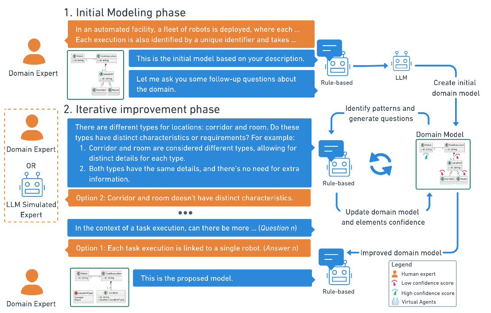

<a name="readme-top"></a>
<!-- ABOUT THE PROJECT -->
## Towards Human-in-the-Loop LLM-enabled Domain Modeling

We propose a HITL framework to improve LLM-enabled domain model generation with a refinement loop. The workflow is organized in two main phases:

1. **Initial Modeling Phase**: Start with a domain description to create a draft domain model.  
2. **Iterative Improvement Phase**: Refine the domain model via a Q&A feedback loop. 



The ToT-Q framework is supported by seven components:

1. **ToT & Confidence Quantification** – Creates the domain model using [ToT4DM](https://github.com/BESSER-PEARL/dsl-tot-dm) framework and estimates confidence of the recommended elements.  
2. **Concept Prioritization** – Prioritizes validation from central concepts outward, using a structure the refinement process based on concepts and confidence.
3. **Element Relevance Validation** – Detects elements with lowest score to validate if necessary in the domain model.  
4. **Modeling Pattern Matching** – Detects modeling patterns in the domain model and uses enabling patterns for a sequence of questions until completed.  
5. **Selection of patterns** – Select matched patterns prioritizing the areas of uncertainty in the domain model using a confidence threshold.  
6. **Question Generation** – Generates questions from selected patterns with a [rule-based agent](https://github.com/BESSER-PEARL/BESSER-Agentic-Framework), adapted to the user modeling expertise.  
7. **Model Refinement** – Updates the domain model and confidence scores based on  domain expert’s answers, until all questions are addressed or a limit is reached.


The ToT-Q tool is developed using the [ToT4DM DSL tool](https://github.com/BESSER-PEARL/dsl-tot-dm), [BESSER Web modeling editor](https://github.com/BESSER-PEARL/BESSER-Web-Modeling-Editor.git) and [BESSER Agentic framework](https://github.com/BESSER-PEARL/BESSER-Agentic-Framework).

<!-- GETTING STARTED -->
## Setup

### Prerequisites

Request OpenAI or Azure keys to have access to the LLM API. Instructions are in the following links:

* [OpenAI](https://platform.openai.com/docs/quickstart)
* [AzureOpenAI](https://learn.microsoft.com/en-gb/azure/ai-foundry/openai/chatgpt-quickstart?tabs=keyless%2Ctypescript-keyless%2Cpython-new%2Ccommand-line&pivots=programming-language-python)

To configure the [ToT DSL](https://github.com/BESSER-PEARL/dsl-tot-dm):
 - Create the .env file as instructed in the [Tot4DM repo](https://github.com/BESSER-PEARL/dsl-tot-dm?tab=readme-ov-file#prerequisites).
 - Review the examples to configure the [ToT4DM DSL](https://github.com/BESSER-PEARL/dsl-tot-dm?tab=readme-ov-file#how-to-create-a-new-model-for-the-dsl).

To configure the BESSER Agentic framework:
 - Configure the config.ini file with the websocket options indicated in the [BESSER Agentic framework docs](https://besser-agentic-framework.readthedocs.io/latest/wiki/configuration_properties.html). 

<!-- RECOMMENDATIONS -->

### How to configure templates

To configure the templates, you can modify the question variables in the following [python file](tot_rules_q/template_questions.py).

### How to configure question triggers

Add in the [.env file](.env_example) the following variables to configure the trigger of questions:

```python
# Maximum number of questions in the Q&A loop
MAX_QUESTIONS = 15

# Relevance threshold for filtering low-confidence elements
RELEVANCE_THRESHOLD = 0.35    # Suggested range: [0.1, 0.5]

# Refinement threshold for triggering questions on uncertain elements
REFINEMENT_THRESHOLD = 0.8    # Suggested range: [0.5, 0.9]

# Confidence values used when updating the model based on expert answers
HIGH_CONFIDENCE = 0.95        # Suggested range: [0.8, 1.0]
LOW_CONFIDENCE = 0.4          # Suggested range: [0.1, 0.5]
```

### Run the project

**Quick Start**: Run both the rule-based agent and editor, then access at http://localhost:5000

#### Rule Agent Setup (Python)
1. Install Python 3.11 and create a virtual environment
2. Install the [required packages](requirements.txt):
   ```sh
   pip install -r requirements.txt
   ```
3. Configure the templates and question triggers in the [.env file](.env_example).
4. Run the rule-based agent (this agent calls the LLM agents):
   ```sh
   python tot_rules_q/rule_agent.py
   ```
5. A log will capture all the thoughts created by the LLM and questions triggered by the rule-based agent.

#### Editor Setup (BESSER Web Modeling Editor)
1. Navigate to BESSER_WME and install Node.js dependencies:
   ```sh
   cd BESSER_WME
   npm install
   ```
2. Start the web modeling editor:
   ```sh
   npm run start:webapp
   ```

<!-- USAGE EXAMPLES -->
## Paper Experiments

The results of the experiments include the [reference models](experiments/ToT-Q_2026/reference_model/) and the [output](experiments/ToT-Q_2026/final_models/) from the experiments.
To run the experiments, use the [input](experiments/ToT-Q/initial_llm_models/) data with the domain descriptions. Then execute the experiment:
   ```sh
   python tot_rules_q/rule_agent.py
   ```
Then start the BESSER Web Modeling Editor in a separate terminal:
   ```sh
   cd BESSER_WME
   npm run start:webapp
   ```
